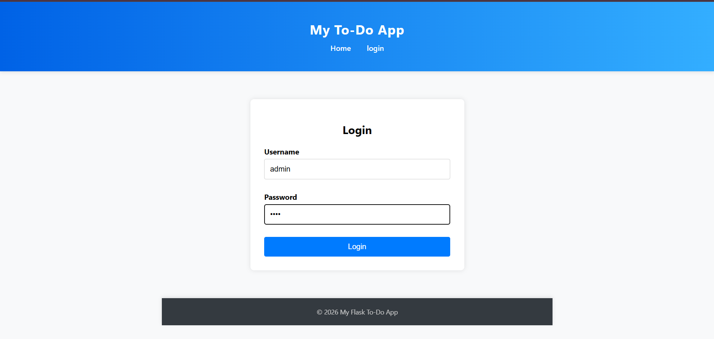
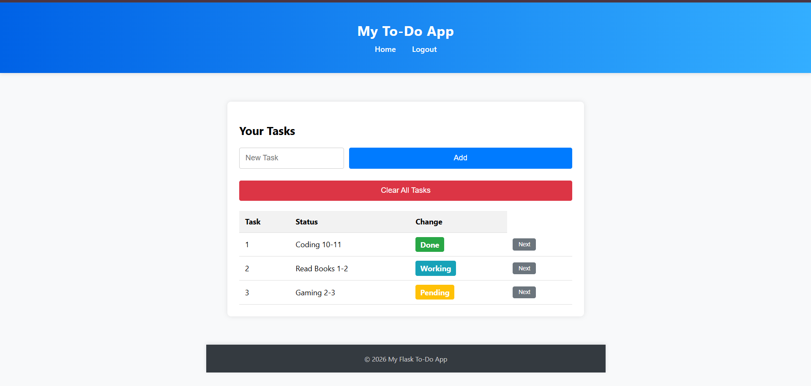

# Flask Learnings and Projects 🚀

A structured Flask learning repository documenting my journey from Flask basics to building complete web applications using Flask, SQLAlchemy, Jinja2, Blueprints, and SQLite.

This repository contains hands-on implementations, mini-projects, and complete Flask applications built while learning backend web development with Python.

---

# 📌 What This Repository Covers

This repository includes:

- Flask Fundamentals
- Routing & Views
- Templates with Jinja2
- Forms Handling
- Flash Messages
- Session Management
- Flask-WTF
- SQLAlchemy ORM
- SQLite Database Integration
- Blueprints & Modular Structure
- CRUD Operations
- Authentication Basics
- Full Flask Projects

---

# 📚 Topics & Projects

## 01️⃣ Basic Flask Application
- Creating Flask apps
- Running Flask server
- Basic routing

---

## 02️⃣ Rendering Templates
- Jinja2 templates
- Dynamic HTML rendering
- Passing variables to templates

---

## 03️⃣ Login Application
- GET & POST requests
- Basic login validation
- User authentication flow

---

## 04️⃣ Student Profile App
- Dynamic profile rendering
- Template variables
- Conditional rendering

---

## 05️⃣ Template Inheritance
- Base templates
- Reusable layouts
- Jinja blocks & extensions

---

## 06️⃣ Form Handling
- HTML forms
- Request processing
- Handling user input

---

## 07️⃣ Flash Messages
- Success/Error notifications
- Flask flashing system
- User feedback handling

---

## 08️⃣ Flask-WTF Forms
- WTForms integration
- Form validation
- Secure form handling

---

## 09️⃣ Flask Application Structure
- Blueprints
- Organized project structure
- Modular Flask applications

---

## 🔟 Database Integration
- SQLite database
- SQLAlchemy ORM
- Models & database operations

---

# 📝 11️⃣ Flask Project — To-Do List App

🔗 [Open Project Folder](11_project_to_do_list_app/)

A complete task management web application built using Flask and SQLite.

## ✨ Features

- User Login System
- Session-based Authentication
- Add New Tasks
- Update Task Status
- Clear All Tasks
- Flash Messages
- Dynamic Task Rendering
- Database Integration using SQLite
- Clean UI using HTML & CSS

---

## 🛠️ Technologies Used

- Python
- Flask
- SQLAlchemy
- SQLite
- Jinja2
- HTML5
- CSS3

---

## 🧠 Concepts Practiced

- CRUD Operations
- Flask Blueprints
- Application Factory Pattern
- Session Management
- Routing & Views
- Template Inheritance
- Database Modeling
- Flash Messaging
- Forms Handling

---

# 📸 Project Preview

## Login Page


---

## Task Dashboard


---

# 📂 Repository Structure

```plaintext
flask-learnings-and-projects/
│
├── 01_basic_flask/
├── 02_templates/
├── 03_login_app/
├── 04_student_profile/
├── 05_template_inheritance/
├── 06_form_handling/
├── 07_flash_messages/
├── 08_flask_wtf/
├── 09_application_structure/
├── 10_database_integration/
├── 11_project_to_do_list_app/
│   ├── to_do_app/
│   ├── screenshots/
│   └── README.md
│
└── README.md
```

---

# ▶️ Running Projects Locally

## Clone the repository

```bash
git clone https://github.com/Ishitag04/flask-learnings-and-projects.git
```

---

## Move into a project folder

Example:

```bash
cd flask-learnings-and-projects/11_project_to_do_list_app/to_do_app
```

---

## Install dependencies

```bash
pip install -r requirements.txt
```

---

## Run the Flask application

```bash
python run.py
```

The Flask server will start on:

```plaintext
http://127.0.0.1:5000
```

---

# 📸 Future Improvements

- Add more complete Flask projects
- Password hashing
- User-specific task storage
- Task deadlines & categories
- Responsive UI improvements
- Deployment on Render

---

# 🎯 Learning Goal

This repository represents my backend web development learning journey while exploring Flask through practical projects and structured implementations.

The goal is to strengthen:

- Backend Development
- Database Handling
- Full-Stack Fundamentals
- Application Architecture
- Real-world Flask Development Skills

---

# 🚀 Future Learning Goals

- Django Development
- REST APIs with Flask
- Authentication Systems
- Flask + React Integration
- Machine Learning Model Deployment
- Full-Stack Web Development

---

# 👩‍💻 Author

## Ishita Garg

B.Tech CSE Student  
Learning Backend Development, Flask, Django, Machine Learning & Data Science through hands-on projects.

GitHub: https://github.com/Ishitag04